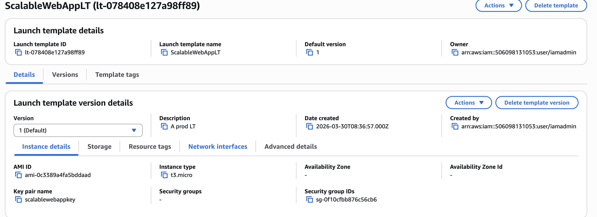
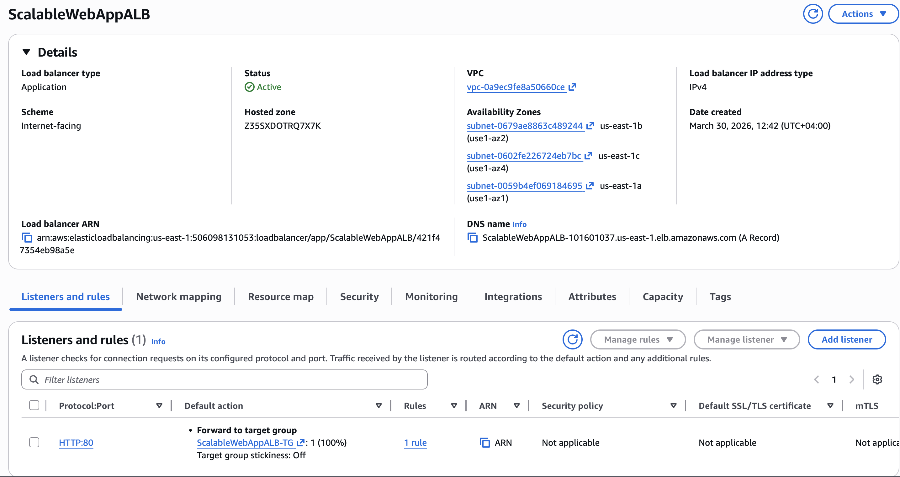
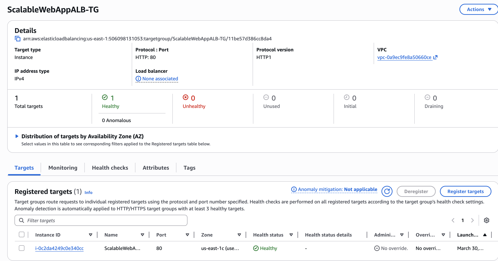
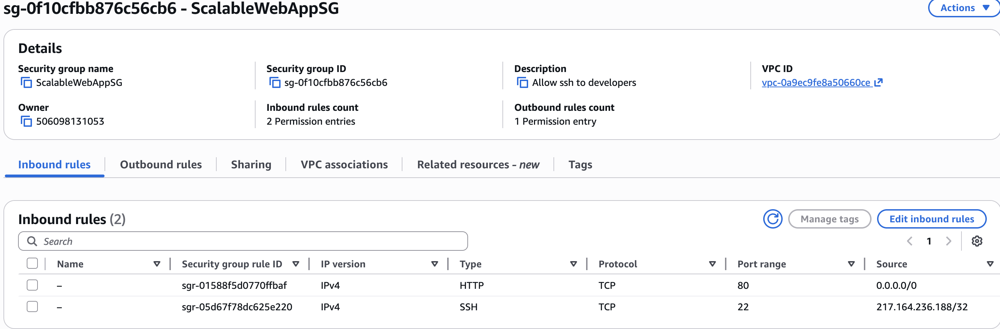
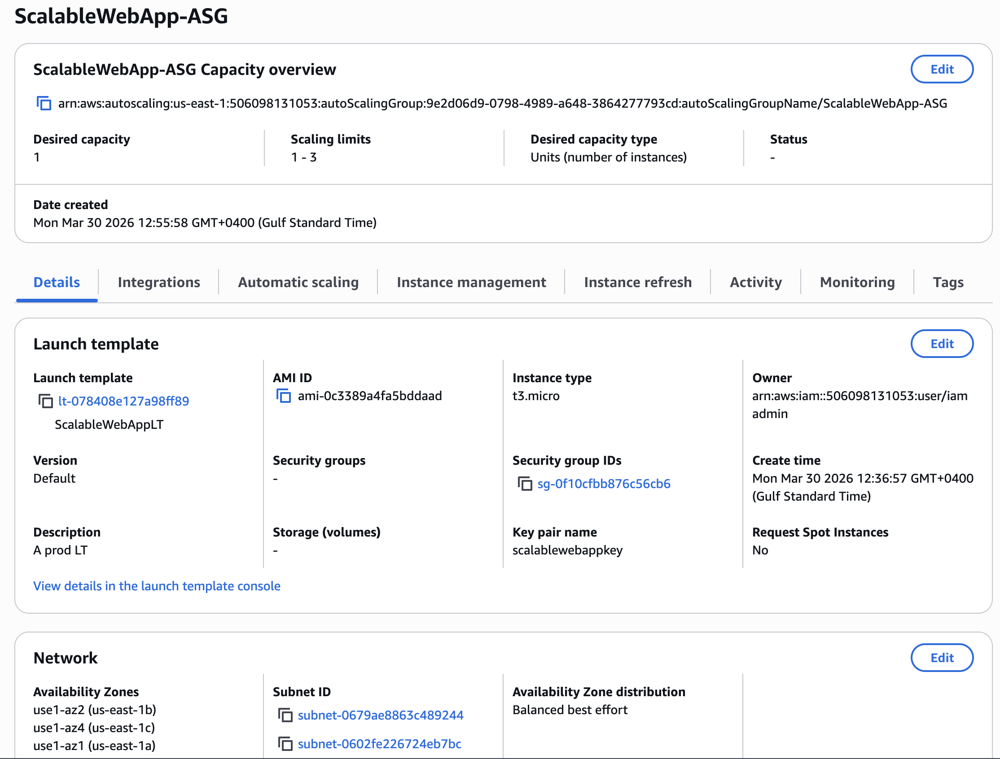
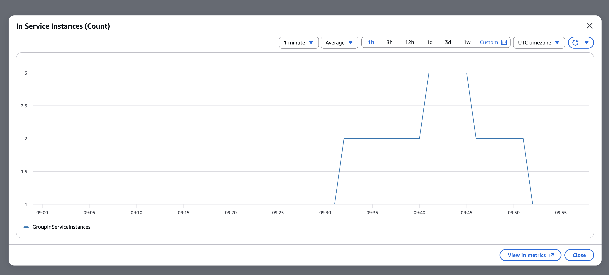
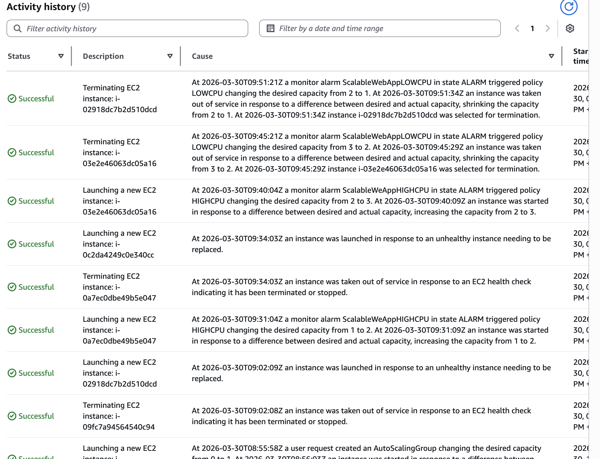

🚀 Scalable Web Application on AWS (ALB + ASG + EC2)

📌 Project Overview

This project demonstrates how to build a highly available and scalable web application on AWS using:
	•	Amazon EC2
	•	Application Load Balancer (ALB)
	•	Auto Scaling Group (ASG)

The architecture automatically adjusts the number of EC2 instances based on CPU utilization, ensuring performance and cost efficiency.

⸻

🏗️ Architecture
	•	Users access the application via Application Load Balancer
	•	ALB distributes traffic across multiple EC2 instances
	•	EC2 instances are managed by Auto Scaling Group
	•	ASG scales instances based on CPU utilization

⸻

⚙️ Services Used
	•	Amazon EC2 – Hosting web server (Apache)
	•	Application Load Balancer (ALB) – Traffic distribution
	•	Auto Scaling Group (ASG) – Automatic scaling
	•	Amazon CloudWatch – Monitoring CPU utilization
	•	Security Groups – Network access control

⸻

🔧 Configuration Details

EC2 Instance
	•	AMI: Amazon Linux
	•	Web Server: Apache (httpd)
	•	Ports:
	•	80 (HTTP) → Open to public
	•	22 (SSH) → Restricted to my IP

⸻

Auto Scaling Group
	•	Minimum capacity: 1
	•	Desired capacity: 1
	•	Maximum capacity: 4

⸻

Scaling Policy
	•	Type: Simple Scaling
	•	Metric: CPU Utilization-High CPU & Low CPU
	•	Target Value: 40%

⸻

🔥 Load Testing

To simulate high traffic and trigger scaling:

sudo yum install -y stress
stress -c 2 -v -t 3000
This generates CPU load on EC2 instances.

⸻

📈 Observations

✅ Scale Out
	•	CPU utilization increased above target
	•	Auto Scaling Group launched new instances
	•	Desired capacity increased (1 → 2 → 3)

✅ Scale In
	•	Stopped load using Ctrl + C
	•	CPU dropped below target
	•	ASG terminated instances (3 → 2 → 1)

⸻

🎯 Key Learnings
	•	How Auto Scaling reacts to real-time CPU load
	•	Importance of sustained load for scaling
	•	Understanding cooldown periods
	•	Load Balancer distributes traffic efficiently
	•	Real-world debugging of scaling issues

⸻

⚠️ Challenges Faced
	- Initially attempted load testing using external HTTP requests from local terminal, but observed that CPU         utilization remained low and Auto Scaling was not triggered.
    - Learned that simple requests do not create sustained load required for scaling policies.
    - Switched to generating CPU load internally on EC2 instances using SSH client and the `stress` tool.
    - This produced consistent high CPU utilization, allowing successful testing of Auto Scaling scale-out and scale-in behavior.
⸻

📸 Screenshots

		
        
        
        
        
        
        
        
        
        
        
        
        
        
        

⸻
📸 Screenshots

        
        
        
        
        
        
        
        
        
        
        
        
        
        

📌 Conclusion

This project demonstrates a real-world scalable architecture using AWS services. The system successfully handled load variations by automatically scaling resources up and down, ensuring high availability and cost optimization.

⸻

🔗 Future Improvements
	•	Add multi-tier architecture (frontend + backend + database)
	•	Use RDS for database layer
	•	Implement CI/CD pipeline
	•	Use Terraform for infrastructure as code

⸻

🙌 Author

Fathima Yosra Ajeeb

